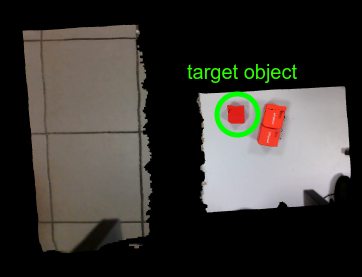
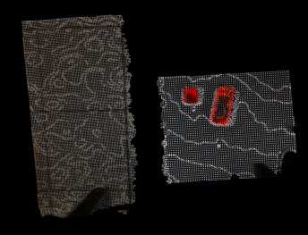
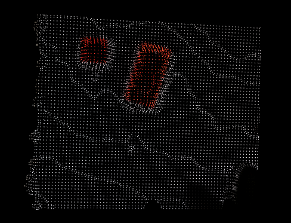
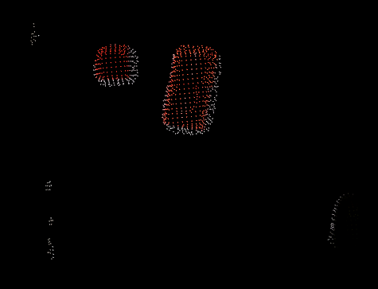
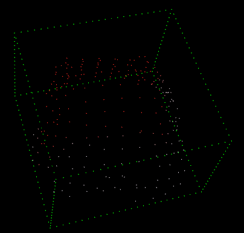
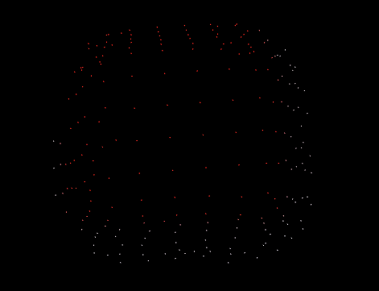

## Kinova Pick Place
ROS 2 package implements a Pick & Place pipeline for Kinova Gen3 6DOF with the Robotiq 2F-85 gripper, using MoveIt 2 and MoveIt Task Constructor.
The system detects a colored cube from a depth camera point cloud, publishes a cube TF frame, inserts the object into the MoveIt planning scene, and executes a complete MTC Pick & Place task.

## Features


- MoveIt 2 Pick & Place pipeline
- MoveIt Task Constructor integration
- PCL-based cube segmentation
- Color-based object selection            
- TF publishing of detected object
- OctoMap for collision avoidance
- Voice command interface
- Simulation + real robot support

## Package Structure
- `src/kinova_pick_place.cpp` – MTC Pick & Place node
- `src/color_cloud_detector.cpp` – cube detector from point cloud
- `src/fake_cloud.cpp` – publishes a PCD as `/camera/depth/color/points` for testing
- `launch/` – simulation/real/mtc launch files
- `config/sensors_3d.yaml` – OctoMap updater configuration
- `data/pcd/` – test PCD clouds
- `rviz/display.rviz` - RViz configuration
- `scripts/...` - voice recognition and command interpreter

## Requirements
- Ubuntu 22.04
- ROS 2 Humble
- MoveIt 2 (Humble)
- MoveIt Task Constructor (Humble branch)
- PCL
- OpenCV
- Kinova ROS 2 (Humble branch): `ros2_kortex`
- Kinova camera: `kinova_vision`

## System Architecture
Pipeline:
1. /camera/depth/color/points
2. PCL filtering + clustering
3. color and shape based cube detection
4. Publish cube TF
5. Add cube to MoveIt planning scene
6. Execute MTC Pick & Place task

## Known Limitations
- Threshold Sensitivity: Threshold values were determined experimentally based on observations of the system’s behavior under varying lighting conditions and at a fixed RGB-D camera distance. Performance may degrade if these conditions change significantly.
- Object Orientation Impact: The orientation of the object affects detection results. For a cube aligned with the camera’s coordinate system, the algorithm achieves a high fill factor. However, rotating the cube around its own Z-axis can reduce the fill value to approximately 10%, depending on the rotation angle.

## Cube Detection Algorythm













## Results
| Object     | Rotation [°] | Ratio XY | h_max [m] | dx [m]  | dy [m]  | dz [m]  | Fill     |
|------------|--------------|------------|-----------|--------|--------|--------|----------|
| Cube       | 0            | 1.009826   | 0.010274  | 0.051736 | 0.051232 | 0.030005 | 0.875281 |
| Cylinder   | 0            | 1.027171   | 0.010092  | 0.036058 | 0.037038 | 0.021061 | 0.806613 |
|                                                                                                |
| Cube       | 0            | 1.025564   | 0.010044  | 0.054828 | 0.053462 | 0.031294 | 0.881301 |
| Sphere     | 0            | 1.057874   | 0.010084  | 0.036075 | 0.038163 | 0.022197 | 0.805262 |
|                                                                                                |
| Cube       | 0            | 1.000678   | 0.010000  | 0.050018 | 0.050052 | 0.030326 | 0.881364 |
| Pyramid    | 0            | 1.107669   | 0.010236  | 0.031060 | 0.028040 | 0.010698 | 0.838161 |
|                                                                                                |
| Cube       | 45           | 1.223560   | 0.010280  | 0.053643 | 0.043842 | 0.029726 | 0.784587 |

## Build
```bash
mkdir -p ~/ros2_ws/src
cd ~/ros2_ws/src
git clone https://github.com/your_username/kinova_pick_place.git
cd ~/ros2_ws
source /opt/ros/humble/setup.bash
colcon build --symlink-install
source install/setup.bash
```

## Bringup For Simulation
```bash
ros2 launch kinova_pick_place bringup_sim.launch.py
```
```bash
ros2 launch kinova_pick_place mtc_pick_place.launch.py
```
```bash
# NOTE: This is a temporary workarounda and sometimes the Point Cloud can spawn upside down, You can manually correct it using a static transform publisher:
ros2 run tf2_ros static_transform_publisher \
  0.25 0.030 0.50 1.57079632679 3.14159265358979 0 base_link camera_color_frame
```

## Bringup For Real Robot:
```bash
ros2 launch kinova_pick_place bringup.launch.py
```
```bash
ros2 launch kinova_pick_place mtc_pick_place.launch.py
```
